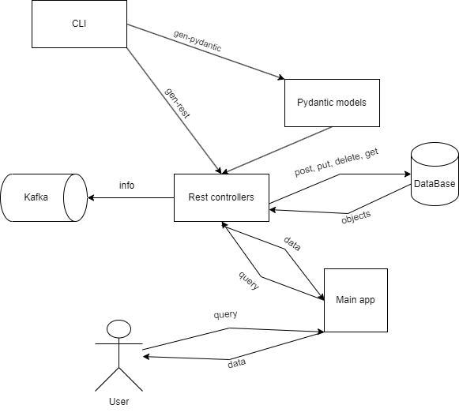

# Профильное задание от VkTech
Данное приложение предназначено для обработки JSON файлов пользователя
Логически можно поделить его на 2 приложения:
1) CLI для обработки пользовательских JSON схем и для генерации pydantic моделей, а так же REST контроллеров
2) Само REST приложение для сохранения пользовательских документов в базу данных, а также для манипуляций с ними

### CLI
Чтобы воспользоваться CLI, перейдите в директорию /cli и выполните следующую команду:

```bash
cli.py --help
```
После этого вы сможете ознакомится со всем функционалом данного приложения

### REST
Чтобы ознакомится со всем функционалом, запустите сервер и перейдите на сайт
http://127.0.0.1:8000/docs

## Схема приложения



Автор: Бекиров Дамир